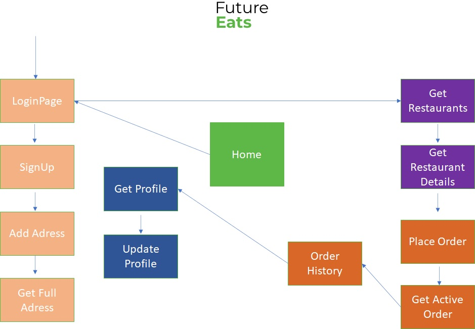

<h2 align="center">FutureEatsB</h2>
<hr/>


## ⚙️ Tecnologias Usadas:
- CSS3
- JavaScript 
- React Js 
- React Hooks
- Styled Components
- Material UI
- React Router
- Axios

## ⚙️ Estrutura do Projeto

- Arquivo `.gitignore`
- Arquivo `package.json`
- Arquivo `package-lock.json`
- Pasta `node_modules`: Armazena os pacotes das dependências que definimos no arquivo package.json. Também deve ser observado que este diretório é definido dentro de .gitignore para que todas as dependências infinitas não sejam carregadas para o repositório Git. Portanto, quem baixar o projeto instalará as dependências [diretamente da web](https://www.npmjs.com/)
- Pasta `public`: Ele contém os arquivos estáticos que nos permitirão montar o aplicativo. Dentro dele está a pasta que contém as imagens dos produtos da loja.
- Pasta `src` (source): A pasta src é a pasta onde nosso código React está localizado.

## ⚙️ Explicação da Aplicação

O aplicativo possui :

- Arquivo App.js:
O arquivo do App, cuja componente é pai de todos, onde importamos o React, o encarregado de desenhar as interfaces.

- Foram utilizados hooks para proteger as páginas cujo acesso é permitido apenas a usuários cadastrados, e encaminhá-los para a página de login/cadastro quando for o caso.

- As requisições de cada endpoint compõem requests.js, presente na pasta services.

- O conjunto de endpoints da API nomeiam as pastas que integram a pasta pages. 

- As componentes Footer e Header permitem navegar pelas páginas de acordo com a ação desejada: Profile, Home, Carrinho, Login, Logout.

- A pasta contants contém as componentes referentes às cores, o tema e a url de base.

-O fluxo entre as páginas está indicado na figura a seguir:



##  Instalação


## 🏁 Para rodar o projeto:

Clone este repositório em sua máquina:

```bash
$ git clone https://github.com/future4code/munoz-futureEatsB.git
```

cd `futureEatsB` e rode:

```bash
npm install
```

para iniciar:

```bash
npm run start
```


<br/>

##  Conclusão

As funções de login, cadastro, logout rodam de acordo com o solicitado. As páginas para profile, add adress, place order. get restaurants foram criadas, bem como a navegação entre estas utilizando o Header e o Footer, porém precisam de ajustes no fluxo de informações.


Atenciosamente,

Jeane Melo.


P.D. Um protótipo deste aplicativo (MVP - Produto Mínimo Viável) pode ser visto no seguinte endereço:

parched-company.surge.sh